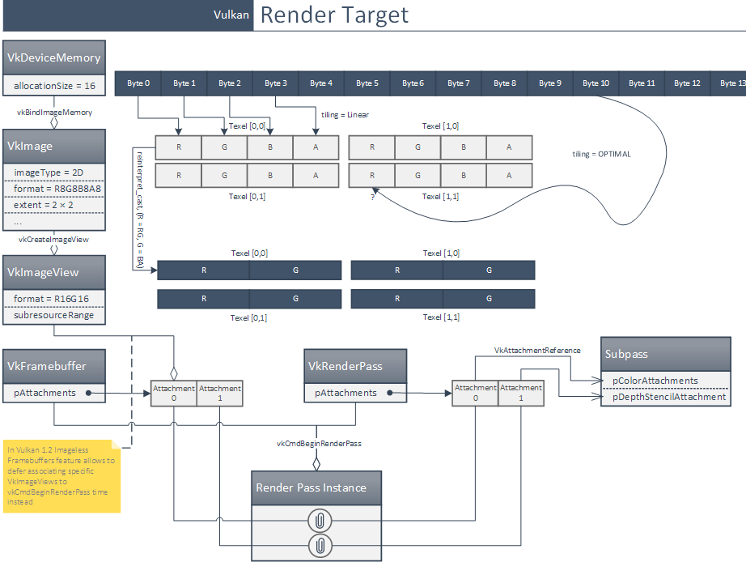

# Vulkan Diagrams
Helpful links: [David-DiGioia](https://github.com/David-DiGioia/vulkan-diagrams?tab=readme-ov-file)

### Simplified flow
Source: [StackOverflow](https://stackoverflow.com/questions/39557141/what-is-the-difference-between-framebuffer-and-image-in-vulkan)

> `VkDeviceMemory` is just a sequence of N bytes in memory

> `VkImage` object adds to it e.g. information about the format (so you can address by texels, not bytes)

> `VkImageView` defines which part of `VkImage` to use

> `VkFramebuffer` binds a `VkImageView` with an attachment

> `VkRenderpass` defines which attachment will be drawn into

> `VkFramebuffer` + `VkRenderPass` defines the render target

